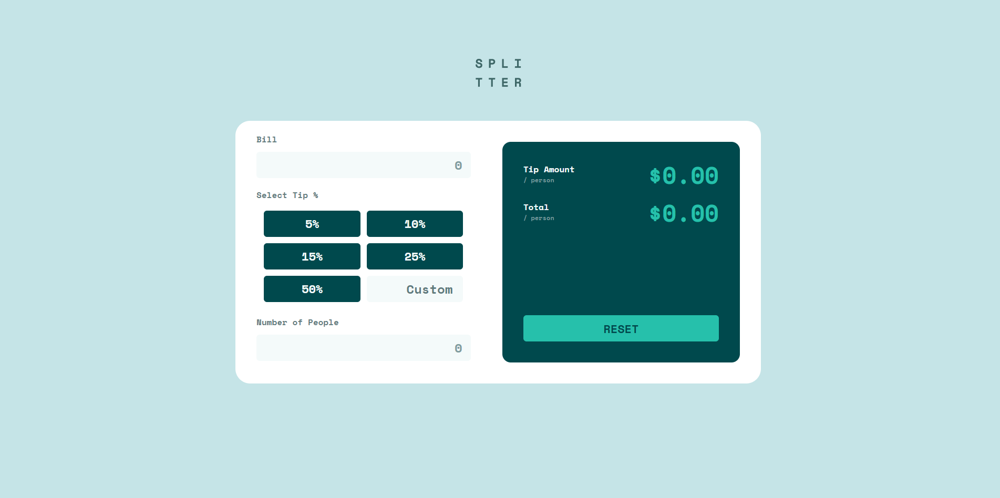

# TIP SPLITTER APP

## Tabla de contenidos

- [Descripcion](#descripcion)
  - [El desafio](#el-desafio)
  - [Screenshot](#screenshot)
  - [Links](#links)
- [Mi proceso](#mi-proceso)
  - [Hecho con](#hecho-con)
  - [Lo aprendido](#lo-que-aprendi)
- [Autor](#autor)

## Descripcion

Solucion al reto de crear un aplicativo que calcule la propina y el total por persona de una cuenta utilizando Vanilla JavaScript.

## El desafio

El usuario deberia poder

- Calcular la propina adecuada y el total por persona de la cuenta.
- Ver el layout optimo dependiendo de su tamano de pantalla.
- Ver la interaccion cuando se coloca el mouse encima de los elementos.

## Screenshot

## Links

- Solucion: [GITHUB](https://github.com/J-HernandezM/tip-splitter)
- Live site: [PAGES](https://j-hernandezm.github.io/tip-splitter/)

## Mi proceso

Ya he realizado componentes o aplicativos como este anteriormente y este se me hizo bastante facil.

Ademas los estilos CSS y la estructura HTML siento que la maneje con soltura.

## Hecho con

- Semantic HTML5 markup
- CSS custom properties
- Flexbox
- CSS Grid
- Mobile-first workflow
- Vanilla JavaScript

## Lo que aprendi

Reforce mis conocimientos de maquetacion y estilos en CSS.

Reforce mis conocimientos de manejo de input y validacion en formularios usando JavaScript. Como por ejemplo evitando que el usuario pueda escribir letras en input text.

## Autor

- Website - [Portfolio en construccion](https://j-hernandezm.github.io)
- Github - [@J-HernandezM](https://github.com/J-HernandezM)
- Twitter - [@__HernandezM](https://www.twitter.com/__HernandezM)